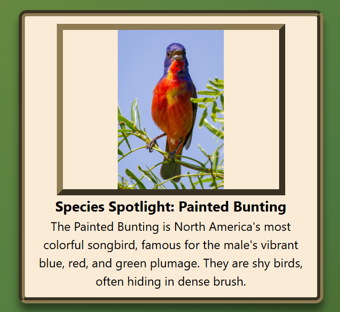
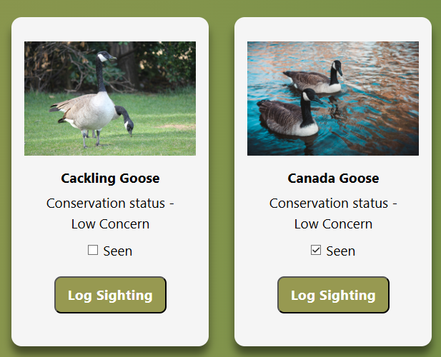
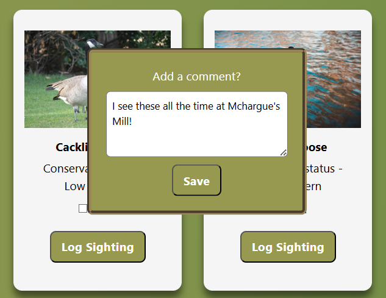
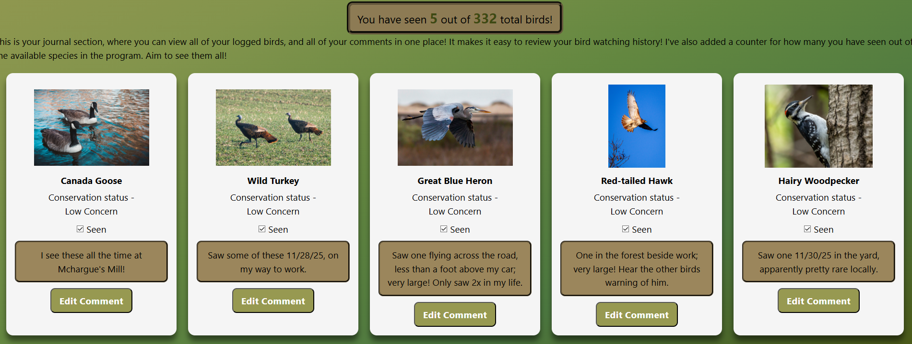

# Go-Find-KY

A web app designed to be used to **log sightings of birds**, with a selection of **300+ birds** in North America, and track personal observations using the Nuthatch API.

Made as a passion project, because I love to bird-watch. I wanted an easier way to keep track of what birds I have seen as I spot them. 
Also wanted to spread awareness of species that are declining in population, because a bird you may spot every day could eventually become extinct.

## How do I use it?

---
**Dependencies** 

- **dotenv v 17.2.3** 
   Loads environment variables.
- **Express JS v 5.1.0**
   Backend web server.
---
**Dev dependencies** 
---
- **nodemon v 3.1.10** 
   Automatically restarts server on file changes. 
---

### Instructions for running

1. **Clone down the repo.**
2. **To install dependencies, open your terminal and run:** `npm install`
3. **Inside your** `env` **file, you must create a key with the parameters:**
`API_KEY=YourAPIKeyGoesHere`
[You can receive an API key here.](https://nuthatch.lastelm.software/getKey.html)
4. **You can then open your terminal and run** `npm start` **to open the site.**
--- 
## Features

- ### Homepage 
---
You can view the **Species Spotlight** feature on the bottom of the homepage, which on refresh, loads another bird's image and a fact from a list of 30 or so birds, with more facts planned to be added in the future.

Upon clicking the **Log a Sighting** button you will be taken to the **log page.** 

- ### Log Page
  
---

Here, you can **search for a particular bird**, mark birds as **seen**, and optionally add **comments** for birds you have marked seen. 

Upon checking the **seen checkbox** and clicking the  **Log sighting** button, you will be prompted to **leave a comment** for that particular bird; if you don't wish to leave a comment you can simply press **save** and it will still save your data. 

 This page contains a list of **332 species of birds** at the time of writing, with their data being pulled from the Nuthatch API
 and dynamically inserted.  

- ### My Journal Page
  
 ---

This is where all your saved data is displayed. All birds that you have **marked as seen** will be shown here, along with your **comments**.

It also displays the **number you have seen** *vs* **total number of species in the data.** 
You can also edit previous comments here, using the **edit comments button**. 

### Technologies used 

---
- HTML
- CSS, including Flexbox and Grid and media queries to ensure responsiveness.
- JavaScript 
- API being used to **dynamically display information in my app by analyzing this data stored in arrays, and objects.**
- **Persisting important data to the user's local storage, including after refresh and reload.**  (Saving sighting, comment feature) 
- **Creating a Node.js server using Express** 
- **Validating user input and either preventing invalid input or informing user**
  (search bar feature)

## License/Use

---

 Feel free to use this project in any way you wish. By yourself, with your peers, host on your site- no limits, as long as proper credits are given! Feel free to edit the project in any way you'd like to match your wishes! I'd be personally interested in any changes you do make, and if you have any suggestions, comments, complaints, or bugs you've noticed, feel free to reach out. 

 ## Updates planned for the future 

 ---
 
 - Add more bird facts, eventually aiming to encompass each included species.
- Branch out to include more than birds; ideally long term including most animals (within reason) from North America.  
 - Include multiple images, songs or calls, and facts on a page where you can examine each species more closely. 
- Create a user login system, so instead of data only being saved locally; on each device, users could login and get their data across all devices. 
- Add a filter option to the log page to filter by size, color, location, or even different species of animals in the future. 
- And many, many more! I plan to add many features and improvements as  I have time to work on the project.
  
## Credits

---
- Credit to Josh Comeau for the basic CSS reset used. 
(https://www.joshwcomeau.com/css/custom-css-reset)

- Credit to all of my wonderful mentors, and peers/classmates from Code:You who helped and inspired me throughout this whole process! 

- Credit for bird search symbol goes to: <a href="https://www.flaticon.com/free-icons/ornithology" title="ornithology icons">Ornithology icons created by pikepicture - Flaticon</a> 

### Final note 

---
I want to personally say, thank you so much for checking out my project! 

 I genuinely hope you enjoy browsing, and would love if you continue to use my program. I hope you enjoy using it as much as I enjoyed making it.

I would LOVE to see your progress in your bird journal if you ever feel like reaching out! It's such a big passion for me and I love seeing other peoples thoughts and experiencing your life through birds you see! 

Thank you, again. 